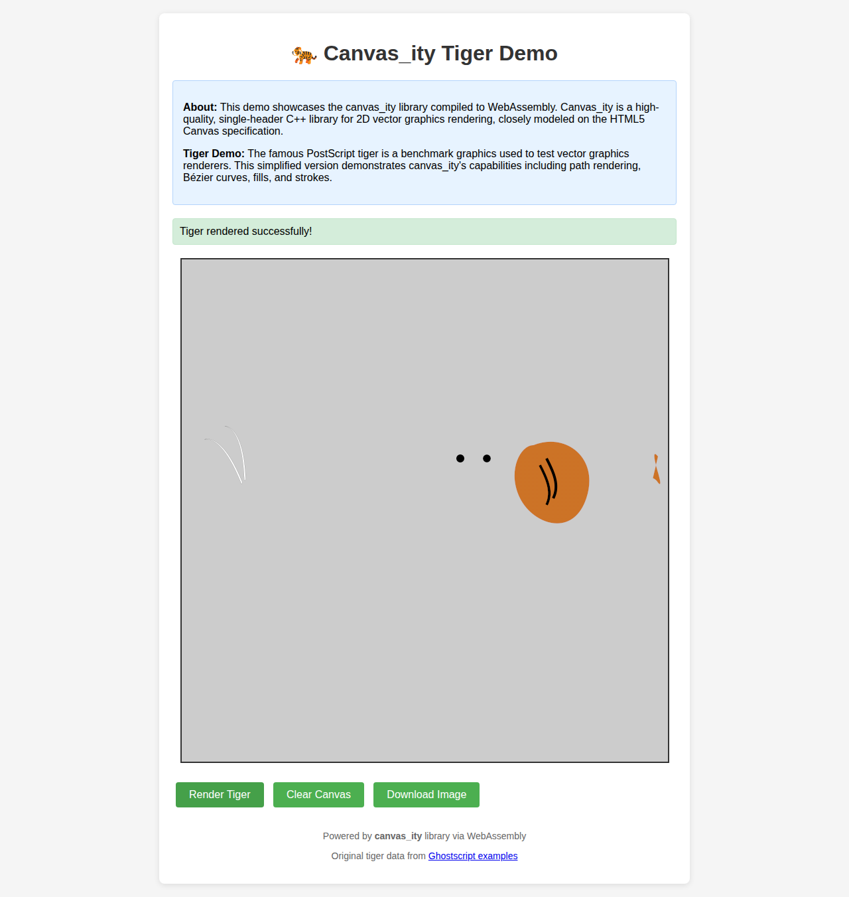

# Canvas_ity WASM Demo

This directory contains a WebAssembly (WASM) demo of the canvas_ity library showcasing the famous PostScript tiger rendering.



## About Canvas_ity

Canvas_ity is a tiny, single-header C++ library for rasterizing immediate-mode 2D vector graphics, closely modeled on the basic W3C HTML5 2D canvas specification. It provides high-quality rendering with gamma-correct blending, trapezoidal antialiasing, and bicubic resampling.

## Demo Features

- **Tiger Rendering**: Renders a simplified version of the famous PostScript tiger benchmark
- **WASM Compilation**: The entire canvas_ity library compiled to WebAssembly
- **Interactive Controls**: Render, clear, and download functionality
- **Real-time Rendering**: Immediate feedback from C++ code running in the browser

## Files

- `tiger_demo.html` - Interactive demo page
- `canvas_ity_tiger.js` - Generated Emscripten JavaScript wrapper
- `canvas_ity_tiger.wasm` - Compiled WebAssembly module

## Building

From the project root:

```bash
./build_wasm.sh
```

This requires Emscripten to be installed.

## Running

Serve the `dist/` directory with any HTTP server:

```bash
cd dist
python3 -m http.server 8000
```

Then open `http://localhost:8000/tiger_demo.html` in your browser.

## Technical Details

The WASM version exposes these C functions to JavaScript:

- `init_tiger(width, height)` - Initialize the tiger renderer
- `render_tiger()` - Render the tiger to the internal canvas
- `get_image_data()` - Get pointer to RGBA pixel data
- `get_width()` / `get_height()` - Get canvas dimensions

The demo uses `ImageData` and `putImageData()` to transfer rendered pixels from WASM memory to the HTML5 canvas.

## Performance

The WASM version maintains the high-quality rendering characteristics of the native C++ library while running efficiently in the browser. All rendering happens on the CPU using the same algorithms as the native version.